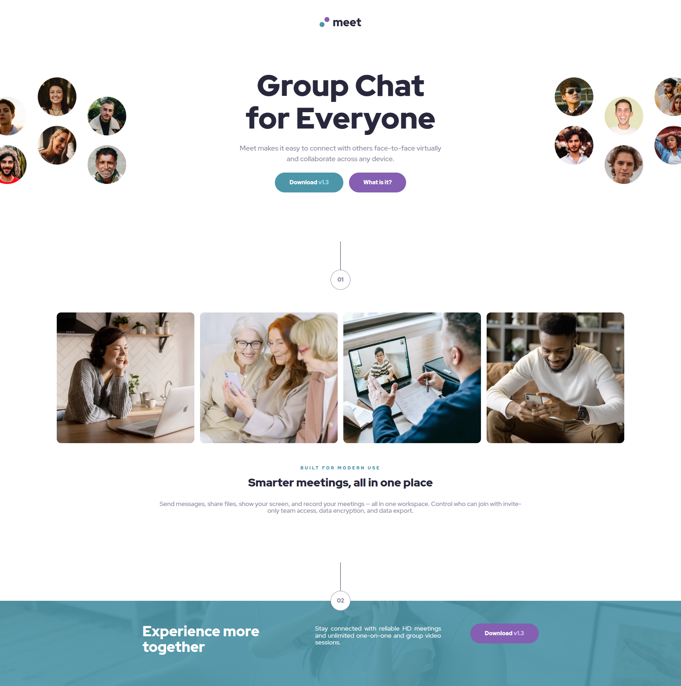

# Frontend Mentor - Meet landing page solution

This is a solution to the [Meet landing page challenge on Frontend Mentor](https://www.frontendmentor.io/challenges/meet-landing-page-rbTDS6OUR). Frontend Mentor challenges help you improve your coding skills by building realistic projects. 

## Table of contents

- [Overview](#overview)
  - [The challenge](#the-challenge)
  - [Screenshot](#screenshot)
  - [Links](#links)
  - [Built with](#built-with)
  - [What I learned](#what-i-learned)
  - [Continued development](#continued-development)
  - [Author](#author)

## Overview

### The challenge

Your users should be able to:

- View the optimal layout depending on their device's screen size
- See hover states for interactive elements

Want some support on the challenge? [Join our community](https://www.frontendmentor.io/community) and ask questions in the **#help** channel.

### Screenshot

### Links

- Solution URL:[https://github.com/codejeroo/testimonials-grid-section]
- Live Site URL:[https://codejeroo.github.io/testimonials-grid-section]

### Built with

- Semantic HTML5 markup
- CSS custom properties
- Flex box
- CSS Grid

### What I learned

I learned how to use translateX property as well as building a hero section where images overflow. It was a challenge and honestly I enjoyed every bit of it. It was a hard starting out in mobile first workflow but I scaled it pretty well using queries. Would've been nice to use em and rem and clamp but this is just a fast spaced solution. I'll update it later on.

### Continued development

I will this as an opportunity to further master CSS Grid and be able to finish task much more faster. 

## Author
- Frontend Mentor - [(https://www.frontendmentor.io/profile/codejeroo)]